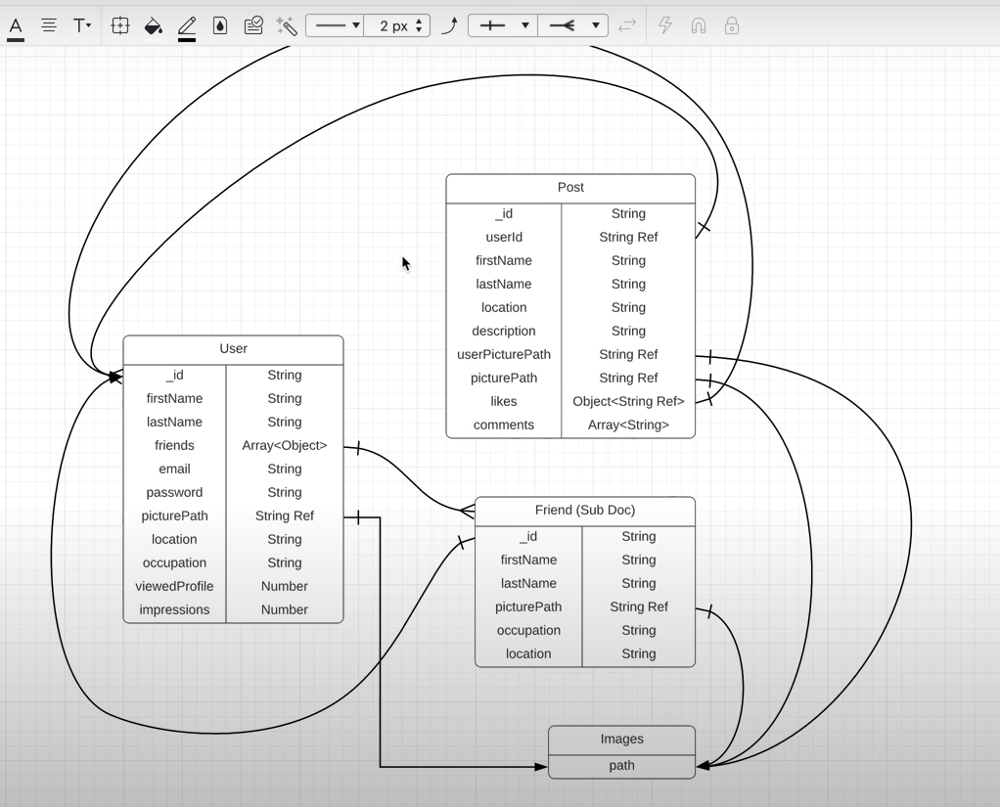

In this project I am Building a COMPLETE Fullstack Responsive MERN App with Auth, Likes, Dark Mode | React, MongoDB, MUI
For the backEnd we are downloading:
 
npm i -g nodemon
 
npm i express body-parser bcrypt cors dotenv gridfs-stream multer multer-gridfs-storage helmet morgan jsonwebtoken mongoose
 
npm init -y
 
While for the frontend we are installing the following packages:
 
npm i react-redux @reduxjs/toolkit redux-persist react-dropzone dotenv formik yup react-router-dom@6 @mui/material @emotion/react @emotion/styled @mui/icons-material
 
@reduxjs/toolkit: An easy way to use redux, its a wrapper around Redux as the main state management library to use
 
redux-persist: Store into local storage if you need to, so we want to save our user and token information into local state so when the user closes the tap and come back information still there in the browser.
 
react-dropzone: Handles file upload and file handling on the frontend so we can send it to the backend.
 
dotenv: For enviroment variables
 
formik: For form handling
 
yup: For validation
 

 
GLOSARY:
- MIDDLEWARE: A FUNCTION THAT RUNS IN BETWEEN DIFFERENT REQUEST
 
- DATA MODELS: WAYS OF ORGANIZING YOUR DATA IN NICE SUCCINCT CATEGORIES MAKING SURE THEY ARE SEPARATE FROM EACH OTHER AND WE CAN MAKE RELAYIONS BETWEEN EACH OTHER. SO, LETS ORGANIZE THIS WEBSITE:

 
- AUTHENTICATION: THIS IS BASICALLY WHEN YOU REGISTER AND LOG IN
- AUTHORIZATION: WHEN YOU WANT TO MAKE SURE SOMEONES LOGGED IN SO YOU CAN PERFOME CERTAIN ACTIONS. SO ONLY USERS THAT ARE LOGGED IN ARE ALLOWED TO SEE THEIR LIST OF FRIENDS AND POST
   
ENCYCLOPEDIA:
 
(1) In order to get the current URL while using module type we actually have to import meta url and then call it with path.dirname 
 
(2) Dotenv is a zero-dependency module that loads environment variables from a .env file into process.env. 
Usage: 
Create a .env file in the root of your project. As early as possible in your application, import and configure dotenv:
require('dotenv').config()
console.log(process.env) // remove this after you've confirmed it is working
 
(3) express.json() is a built in middleware function in Express starting from v4.16.0. It parses incoming JSON requests and puts the parsed data in req.body. https://masteringjs.io/tutorials/express/express-json
 
(4) Helmet.js is an open source JavaScript library that helps you secure your Node.js application by setting several HTTP headers. It acts as a middleware for Express and similar technologies, automatically adding or removing HTTP headers to comply with web security standards. Although not a silver bullet, Helmet makes it harder for attackers to exploit known vulnerabilities. It helps to protect Node.js Express apps from common security threats such as Cross-Site Scripting (XSS) and click-jacking attacks. Without Helmet, default headers returned by Express expose sensitive information and make your Node.js app vulnerable to malicious actors. https://blog.logrocket.com/using-helmet-node-js-secure-application/#what-helmet
 
(5) Cross-Origin Resource Policy is a policy set by the Cross-Origin-Resource-Policy HTTP header that lets websites and applications opt in to protection against certain requests from other origins such as those issued with elements like script and img. policy: 'cross-origin' : Requests from any origin (both same-site and cross-site) can read the resource.
https://developer.mozilla.org/en-US/docs/Web/HTTP/Cross-Origin_Resource_Policy
 
(6) Using Morgan, you can easily log requests made to your Node.js server, including information such as the request method, the URL of the request, the status code of the response, and the length of the response body. 
morgan(’common’): It follows the standard apache common output format while logging. https://signoz.io/blog/morgan-logger/#:~:text=Morgan%20is%20a%20popular%20HTTP,js%20applications.
 
(7) Returns middleware that only parses json and only looks at requests where the Content-Type header matches the type option. This parser accepts any Unicode encoding of the body and supports automatic inflation of gzip and deflate encodings. https://expressjs.com/en/resources/middleware/body-parser.html#:~:text=bodyParser.,of%20gzip%20and%20deflate%20encodings.
 
(8) Returns middleware that only parses urlencoded bodies and only looks at requests where the Content-Type header matches the type option. This parser accepts only UTF-8 encoding of the body and supports automatic inflation of gzip and deflate encodings. URL Encoding is the process of converting string into valid URL format. Valid URL format means that the URL contains only what is termed "alpha | digit | safe | extra | escape" characters.
 
(9) Cross-Origin Resource Sharing (CORS) is an HTTP-header based mechanism that allows a server to indicate any origins (domain, scheme, or port) other than its own from which a browser should permit loading resources. 
 
(10) Using this multer configuration you will be able to save files, so any time someone uploads a file onto this website, then its going to say destination is going to be saved into 'public/assets' folder
 
(11) Anytime we need to upload a file we are using the 'storage' varianle 
 
(12) According to the documentation:
-->unifiedtopology : DeprecationWarning: current Server Discovery and Monitoring engine is deprecated, and will be removed in a future version. To use the new Server Discover and Monitoring engine, pass option { useUnifiedTopology: true } to the MongoClient constructor.
-->usenewurlparser : DeprecationWarning: current URL string parser is deprecated, and will be removed in a future version. To use the new parser, pass option { useNewUrlParser: true } to MongoClient.connect.
 
(13) Tipically you have a roue, so /auth/register is the route that we are going to hit for routes with files, from there we are using a middleware where we upload a single picture locaaly into the picture/assets folder, this is why it is called midddleware because is in between and before the actual logic which is register controller in this case